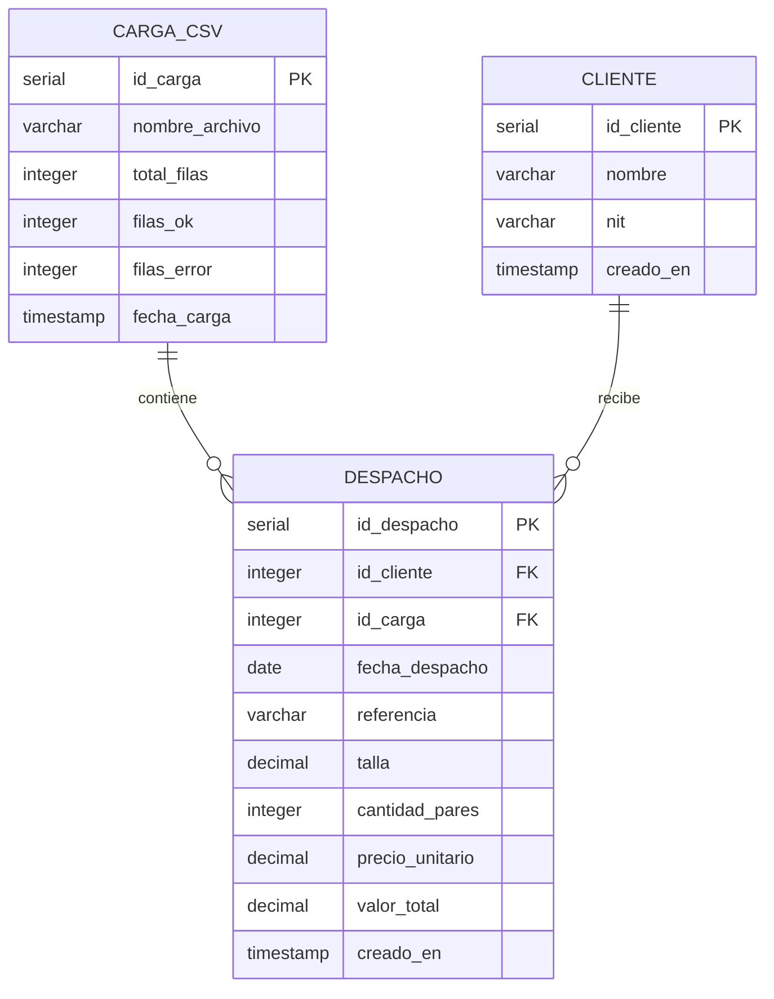
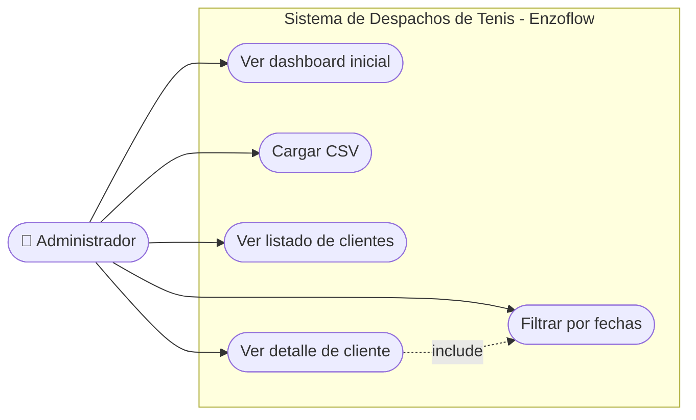
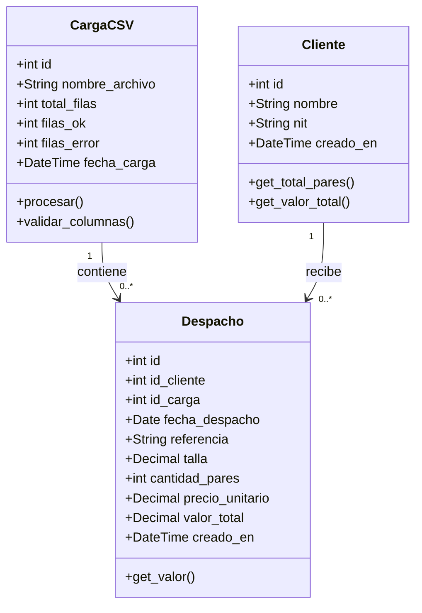
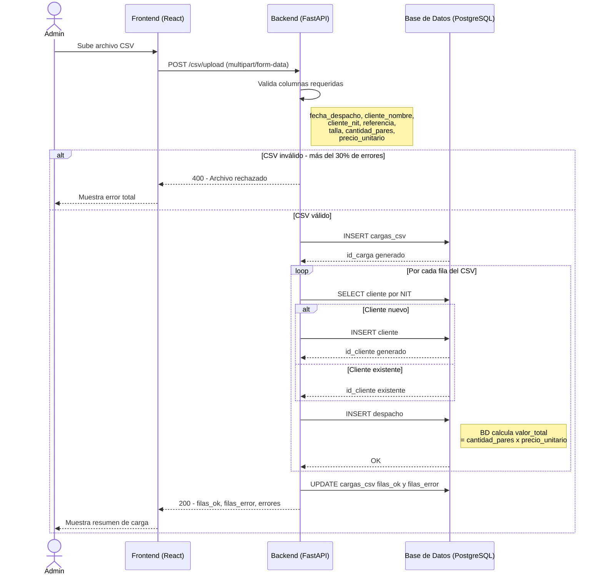
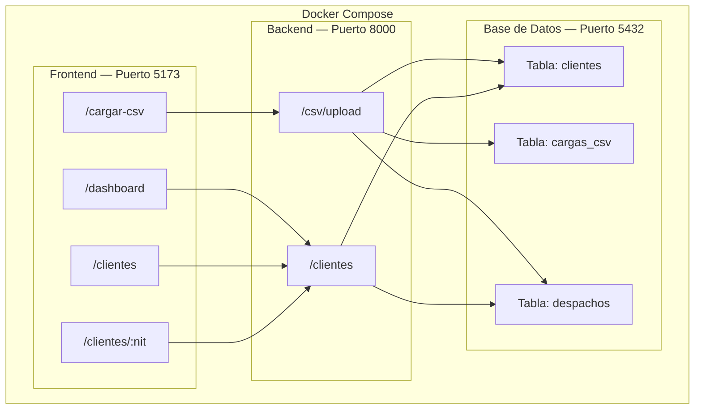

# Diagramas UML — Sistema de Despachos de Tenis

---

## 3.2.1 Modelo Entidad-Relación

---

## 3.4.1 Diagrama de Casos de Uso

---

## 3.4.2 Diagrama de Clases

---

## 3.4.3 Diagrama de Secuencia — Carga de CSV

---

## 3.4.4 Diagrama de Componentes

